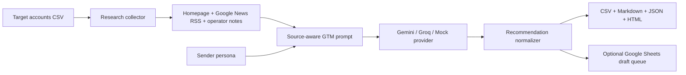

# AI GTM Command Center

## The Problem

AI startup founders need high-context GTM, but target-account research, ICP judgment, draft copy, and follow-up discipline usually live in separate tabs.

## What This Does

AI GTM Command Center turns a CSV of target accounts into a ranked GTM workbench: account research, fit scoring, pain hypotheses, personalization points, founder-call talk tracks, and human-approved cold-email drafts.

It is intentionally **draft-only**. The project shows how to build AI leverage into outbound without creating an uncontrolled spam bot.

## Output Sample

```text
ContextLayer AI - 96/100 (High)

Why this account:
ContextLayer AI looks like a high-priority account because the available signals suggest founder-led GTM work where lightweight AI operations can save time.

Offer angle:
Open-source AI GTM workflow plus a small Founder's Office pilot: source-backed account research, fit scoring, and approved outreach drafts.

Draft email:
Subject: ContextLayer AI GTM workflow idea

Hi Aarav Mehta,

I was looking at ContextLayer AI and had a practical GTM ops thought. For AI startups,
the painful part is usually not writing one good email; it is keeping account research,
fit scoring, proof points, follow-ups, and next actions in one operating loop.

I built an open-source AI GTM Command Center that turns a target-account CSV into a scored
draft queue with source-backed personalization and follow-up notes for founder approval.

If useful, I can share the repo and also build a 10-account pilot around your ICP.
```

## Why I Built This

This is the kind of operating loop a Founder's Office hire should be able to design, ship, and improve without waiting for a large RevOps stack.

## Built By

Shubham Singh - Founder's Office candidate focused on AI-native operating systems for early-stage founders.

- Built RevOps infrastructure from scratch at a founder-led startup.
- Looking for Founder's Office roles at early-stage AI startups where GTM, operations, and analytics sit close to the founder.
- LinkedIn: <https://linkedin.com/in/shubham9616>
- GitHub: <https://github.com/shubham1502-hue>

## Features

- CSV target-account ingestion.
- Website research with robots-aware homepage fetching.
- Google News RSS enrichment without a paid API key.
- Gemini, Groq, or deterministic mock provider.
- Fit score, priority, rationale, pain hypotheses, personalization points, objections, and call talk track.
- Draft email and follow-up queue.
- Outputs as CSV, Markdown brief, JSON, and a clean HTML report.
- Optional Google Sheets sync for a founder-style draft queue and CRM handoff.
- Offline mode for demos, tests, and GitHub screenshots.

## Quickstart

Run the demo with no API key:

```bash
python -m pip install -e .

python -m gtm_command_center run \
  --targets examples/target_accounts.csv \
  --persona examples/persona.md \
  --provider mock \
  --offline \
  --out outputs/demo
```

Open:

- `outputs/demo/gtm_report.html`
- `outputs/demo/gtm_brief.md`
- `outputs/demo/draft_queue.csv`

## Using Gemini

Gemini is the best free-tier-first default for this portfolio project.

```bash
python -m pip install -e '.[gemini]'
cp .env.example .env
# Add GEMINI_API_KEY to .env

python -m gtm_command_center run \
  --targets examples/target_accounts.csv \
  --persona examples/persona.md \
  --provider gemini \
  --out outputs/gemini-run
```

## Using Groq

Groq support uses its OpenAI-compatible API through Python's standard library.

```bash
cp .env.example .env
# Add GROQ_API_KEY to .env

python -m gtm_command_center run \
  --targets examples/target_accounts.csv \
  --persona examples/persona.md \
  --provider groq \
  --out outputs/groq-run
```

## Optional Google Sheets Sync

Google Sheets sync is the recommended scalable next step because it is free-tier friendly and keeps outreach human-approved.

```bash
python -m pip install -e '.[sheets]'
cp .env.example .env
# Add GOOGLE_SHEET_ID and GOOGLE_SERVICE_ACCOUNT_JSON to .env
# Share the Google Sheet with the service-account email.

python -m gtm_command_center run \
  --targets examples/target_accounts.csv \
  --persona examples/persona.md \
  --provider mock \
  --offline \
  --sync-sheets
```

Full setup notes: [docs/google_sheets_setup.md](docs/google_sheets_setup.md)

## Input Format

Minimum CSV:

```csv
company,website
Acme,https://example.com
```

Recommended CSV:

```csv
company,website,segment,target_person,target_role,email,notes
Acme,https://example.com,B2B SaaS,Asha Rao,Founder,asha@example.com,"Seed-stage founder-led sales motion."
```

## Architecture



## Safety and Compliance Choices

- No LinkedIn scraping.
- No automatic email sending.
- Drafts require human approval.
- Sources and warnings are preserved in outputs.
- The model is instructed not to invent facts or imply a prior relationship.
- Commercial outreach still needs jurisdiction-specific review for consent, opt-out, address, and sender identity requirements.

## Portfolio Framing

This project is built to signal:

- You can turn a founder pain into a usable operating system.
- You understand LLM APIs as infrastructure, not novelty.
- You can design human-in-the-loop automation where judgment matters.
- You know when not to automate, especially around cold outreach and platform terms.
- You can package founder-facing work as both a useful open-source artifact and a credible pilot offer.

## Customization Checklist

Before publishing, update:

- Add a screenshot of `outputs/demo/gtm_report.html`.
- Add the final public GitHub repo URL if the repository name changes.
- Replace fictional sample companies with a demo dataset from your target founder segment.
