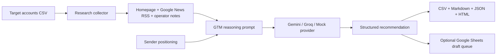

# AI GTM Command Center

## Problem This Solves

Early-stage founders often run GTM from scattered CSVs, browser tabs, notes, and half-written follow-ups. The problem is not just writing outreach. It is turning messy account context into a repeatable founder-approved sales workflow.

## How It Helps

- Turns a target-account CSV into scored account briefs, pain hypotheses, talk tracks, email drafts, follow-ups, and reviewable outputs.
- Keeps the workflow human-approved so founders get leverage without turning their brand into a spam machine.
- Runs offline with a mock provider for demos, then upgrades to Gemini, Groq, and optional Google Sheets sync.

## When To Fork This

- Fork this if you are a founder, founder's office hire, RevOps operator, or GTM analyst building a first outbound operating system.
- Fork it when your account research, ICP scoring, and follow-up discipline are living in too many places.
- Customize the persona, target CSV columns, scoring rubric, prompt, and Google Sheet output around your own ICP.

I built this because most early-stage AI founders do not have their GTM work in one clean place.

The account list is in a CSV. Research is in browser tabs. Follow-ups are in someone's head. ICP judgment is partly intuition. Email drafts are written from scratch every time. By the time the founder sits down to sell, the actual operating system is still missing.

This repo is how I would start fixing that.

## What This Does

AI GTM Command Center takes a CSV of target accounts and turns it into a founder-ready GTM workbench.

For each company, it creates:

- account research
- ICP fit score
- priority level
- pain hypotheses
- personalization points
- founder-call talk track
- likely objections
- cold email draft
- follow-up draft
- source links and warnings

It is intentionally draft-only. I do not want this to be a spam bot. I want it to be the system before the send button: research, judgment, prioritization, and clean follow-up discipline.

## Why I Built This

I approached this as a Founder's Office candidate, not as someone trying to ship another generic AI wrapper.

At STEMpedia, I built RevOps infrastructure from scratch inside a founder-led startup: CRM workflows, reporting, handoffs, automations, and weekly CEO visibility. That taught me something simple: founders do not just need analysis. They need systems that reduce the number of things they personally have to remember.

This project is built from that lens.

If I were working with an AI startup founder, this is the kind of workflow I would want to build in week one: take a messy GTM motion, make the work visible, use AI where it saves time, and keep the final judgment with the human.

## Example Output

```text
ContextLayer AI - 96/100 (High)

Why this account:
ContextLayer AI looks like a high-priority account because the available signals suggest founder-led GTM work where lightweight AI operations can save time.

Offer angle:
Open-source AI GTM workflow plus a small Founder's Office pilot: source-backed account research, fit scoring, and approved outreach drafts.

Draft email:
Subject: ContextLayer AI GTM workflow idea

Hi Aarav Mehta,

I was looking at ContextLayer AI and had a practical GTM ops thought. For AI startups,
the painful part is usually not writing one good email; it is keeping account research,
fit scoring, proof points, follow-ups, and next actions in one operating loop.

I built an open-source AI GTM Command Center that turns a target-account CSV into a scored
draft queue with source-backed personalization and follow-up notes for founder approval.

If useful, I can share the repo and also build a 10-account pilot around your ICP.
```

## How It Works



The system is deliberately simple:

1. Start with a CSV of target accounts.
2. Pull lightweight public context from the company website and Google News RSS.
3. Combine that with operator notes.
4. Ask the LLM to reason through fit, pain, personalization, objections, and outreach.
5. Export everything into files a founder or GTM team can actually review.
6. Optionally sync the draft queue to Google Sheets.

## Why This Is AI-Native

I am not using AI here as a novelty layer.

The LLM is doing the work that is usually slow, repetitive, and judgment-heavy:

- turning messy context into a structured account brief
- generating a first-pass outreach angle
- identifying what should be validated before a founder reaches out
- keeping the output in a format that can move into an operating workflow

The important part is not the model name. It can run with Gemini, Groq, or a deterministic mock provider. The important part is the operating loop around the model.

## What Founders Can Use This For

- Build a first-pass outbound list for founder-led sales.
- Score which accounts deserve attention first.
- Create a human-approved draft queue.
- Give an intern, analyst, or founder's office hire a cleaner GTM workflow.
- Turn scattered account research into a weekly operating habit.

This is especially useful for early AI startups where the founder is still close to sales, positioning, product feedback, and investor narrative.

## Stack

- Python
- Gemini API or Groq API
- Google News RSS
- Robots-aware website fetching
- CSV, Markdown, JSON, and HTML outputs
- Optional Google Sheets sync

The default demo runs with no API key.

## Quickstart

Run the demo:

```bash
python -m pip install -e .

python -m gtm_command_center run \
  --targets examples/target_accounts.csv \
  --persona examples/persona.md \
  --provider mock \
  --offline \
  --out outputs/demo
```

Then open:

- `outputs/demo/gtm_report.html`
- `outputs/demo/gtm_brief.md`
- `outputs/demo/draft_queue.csv`

## Using Gemini

Gemini is the easiest free-tier-first option for this project.

```bash
python -m pip install -e '.[gemini]'
cp .env.example .env
# Add GEMINI_API_KEY to .env

python -m gtm_command_center run \
  --targets examples/target_accounts.csv \
  --persona examples/persona.md \
  --provider gemini \
  --out outputs/gemini-run
```

## Using Groq

Groq is useful as a fast fallback provider.

```bash
cp .env.example .env
# Add GROQ_API_KEY to .env

python -m gtm_command_center run \
  --targets examples/target_accounts.csv \
  --persona examples/persona.md \
  --provider groq \
  --out outputs/groq-run
```

## Optional Google Sheets Sync

I added Google Sheets sync because it matches how founder teams actually work.

Not every founder wants to run Python. But every founder understands a sheet with account, score, rationale, draft, follow-up, and next action.

```bash
python -m pip install -e '.[sheets]'
cp .env.example .env
# Add GOOGLE_SHEET_ID and GOOGLE_SERVICE_ACCOUNT_JSON to .env
# Share the Google Sheet with the service-account email.

python -m gtm_command_center run \
  --targets examples/target_accounts.csv \
  --persona examples/persona.md \
  --provider mock \
  --offline \
  --sync-sheets
```

Setup notes: [docs/google_sheets_setup.md](docs/google_sheets_setup.md)

## Input Format

Minimum CSV:

```csv
company,website
Acme,https://example.com
```

Recommended CSV:

```csv
company,website,segment,target_person,target_role,email,notes
Acme,https://example.com,B2B SaaS,Asha Rao,Founder,asha@example.com,"Seed-stage founder-led sales motion."
```

## Safety Choices

I made a few opinionated choices on purpose:

- No LinkedIn scraping.
- No automatic email sending.
- Drafts require human approval.
- Sources and warnings stay visible.
- The model is told not to invent facts or imply a prior relationship.

That matters because founder-facing automation should create leverage without creating reputational risk.

## About Me

I am Shubham Singh, a Founder's Office candidate focused on AI-native operating systems for early-stage founders.

I have built RevOps infrastructure from scratch at a founder-led startup and I am looking for Founder's Office roles at early-stage AI startups where GTM, operations, analytics, and execution sit close to the founder.

- LinkedIn: <https://linkedin.com/in/shubham9616>
- GitHub: <https://github.com/shubham1502-hue>

If you are a founder reading this, the repo is open for you to use. If you want this adapted to your own ICP, funnel, CRM, or weekly GTM rhythm, that is exactly the kind of work I want to do.
